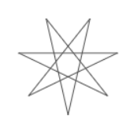
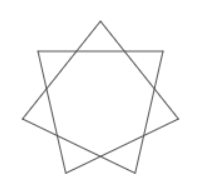
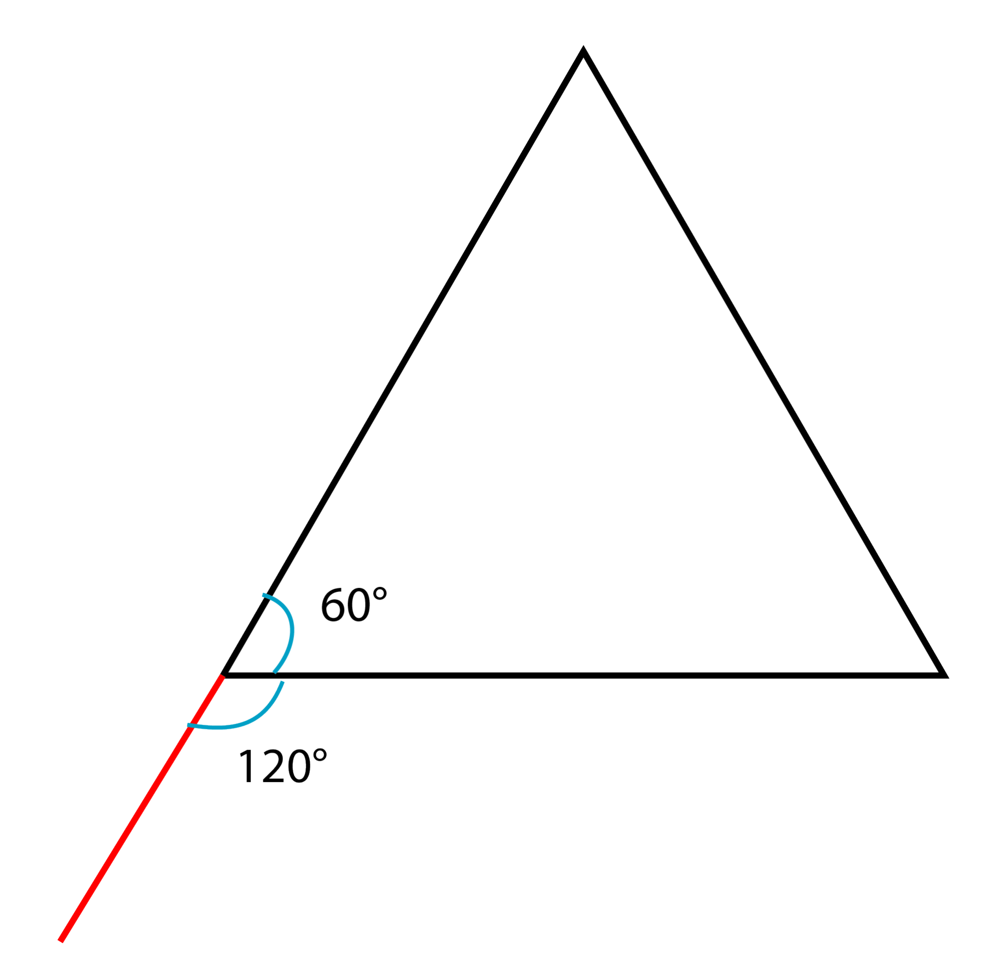
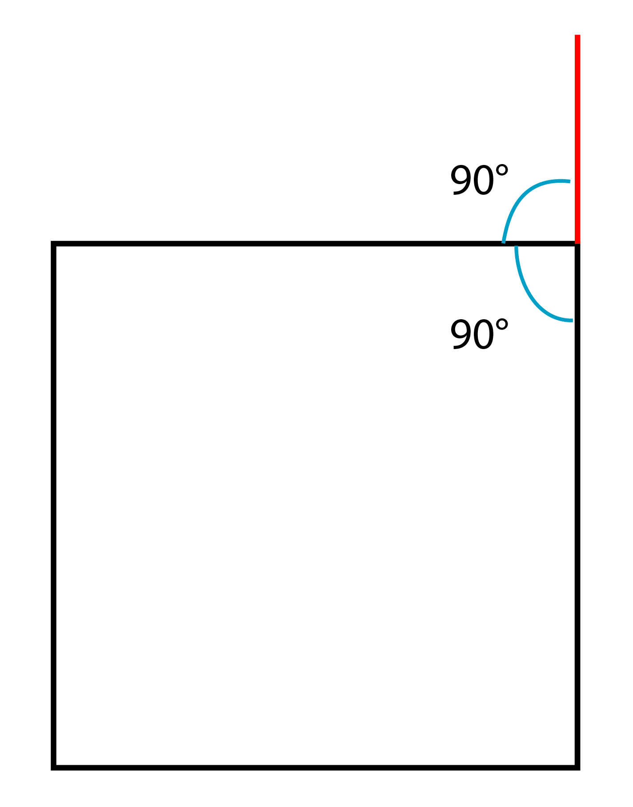
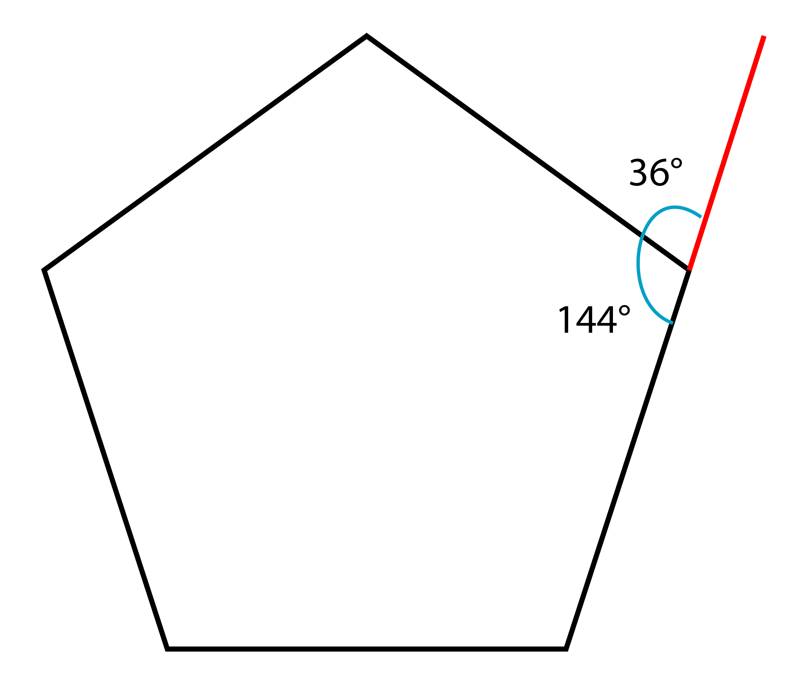
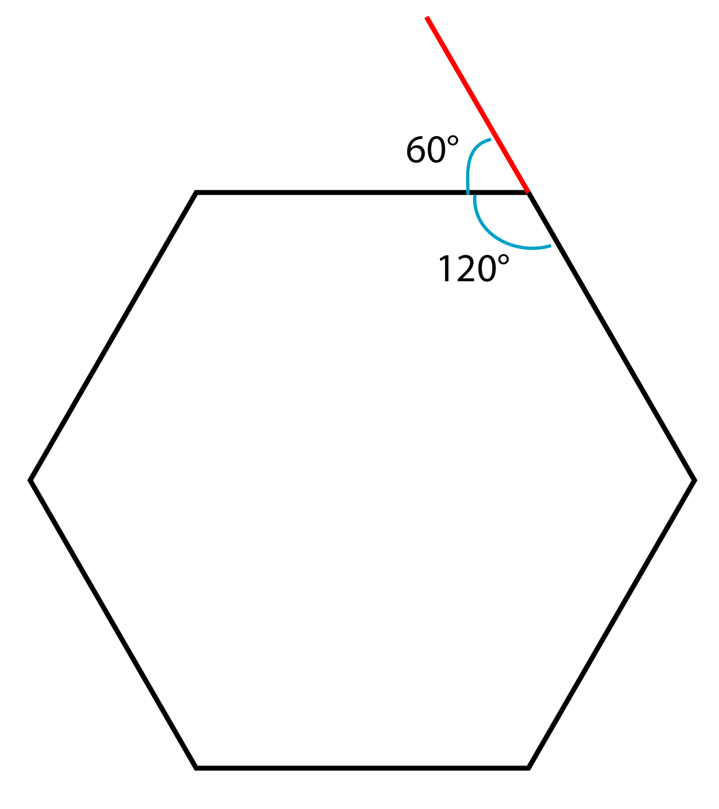

# Project 3: PolygonDraw

## Objectives
In this project you will learn about different types of loops and how and when to use them. We will also be learning about functions (Snap reporter blocks) and procedures (Snap command blocks), parameters, and local variables.

## Description
In this assignment you will be coding up various polygon drawing functions, generalizing those functions using parameters, and then extending those functions to create a final project program.

### Assignments
1. Sequential & looped polygon drawing 
   1. Make the default sprite draw a square
   1. Draw a triangle
   1. Draw a hexagon
   1. Make each of your programs draw its shape using a loop
   1. (Each of these should be in the same file as separate snippets of code. You should have six snippets when you’re done.)
1. Create Command Blocks of your drawing shapes programs
   1. Pick one of your shapes and draw it in six different places on the stage
   1. Change your mini programs into Command Blocks
      1. Use your command blocks to draw shapes in various places on the stage
1. Adding parameters to your shape drawing procedures 
   1. Add position parameters to your blocks
   1. Add a size parameter to your block
   1. Write a program that exercises your new parameters
   1. BONUS: Can you think of any other parameters you could add to your block?
1. Generalize the draw procedures (blocks) to a single drawShape procedure
   1. Make your drawShape block able to draw a polygon of any number of sides depending on a parameter
   1. Keep the circumference the same no matter how many sides based on a radius
   1. Write a control structure (when green flag clicked) that uses the drawShape block to draw seven different shapes in different places.
1. Use your blocks to do something cool/fun 
   1. This is where you get to be creative. Do something using your shape command block(s) that will make me go “WOW!” You might want to think about rotating the shapes as you draw them. You can create a program that creates a static end product or one that creates a dynamic “show.” Be Creative.

### Bonus Assignments
1. Create more command drawing blocks -- eg: draw star, draw spiral
1. Idea #1) Make a draw star block, one that draws a star with the given number of vertices
   1. You can expand this by making one that draws a shallow star and one that draws a deep star. 
   1. Start with odd # of vertices and then work on evens if you finish
1. Idea #2) Make a spiral draw block that can draw a spiral of any beginning and end radius
   1. Use parameters to control the values that the program uses that can draw a spiral 

### Deep Star

### Shallow Star

### The Math
Regular polygons are polygons whose sides are all the same length and whose angles between sides are all the same size.

* **The sum of exterior angles of a regular polygon is 360&deg;, so it follows that the measure of the exterior angle of an n-sided regular polygon is**

* **The measure of the interior angle of a regular polygon is** 

measure of exterior angle

* **Therefore**

Interior angle = measure of exterior angle

Exterior angle = 

* **Using substitution**

Interior angle = 
               = 
               = 
               = 
