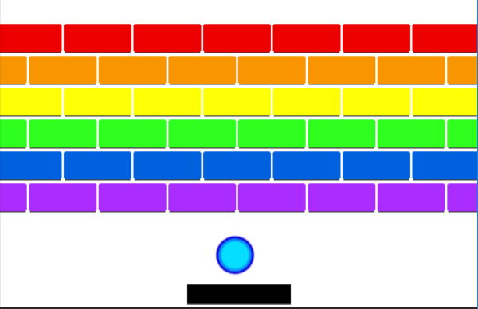

# Project 4: Breakout

## Objectives
In this project we will be learning about cloning, its uses and advantages, and how to create and program clones. Cloning is a very important aspect of programming, as it helps to make the program use less memory and run  faster than if it were using a bunch of permanent objects.

## Description
In this assignment you will be required to make a program similar to pong, but use clones to create multiple objects that must be destroyed. The overall theme will be up to the student.

## Breakout
In breakout, you have to use a paddle at the bottom of the screen to bounce a ball into some obstacles on the screen and destroy them until none are left on screen, then the game puts more objects on the screen for the next level. The paddle is moved by the left and right arrows, and stays on the screen no matter what. The objects on the screen can be any shape and disappear when hit with the ball. The ball bounces off of the paddle, the walls, and the objects on the screen, but removes a life every time it hits the bottom of the screen. You win if all objects are destroyed before losing all your lives.

### Assignments
1. Destroy Targets 
   1. Create 12 target sprites that are the same
      1. Make it so that when the mouse pointer touches a sprite it is hidden 
      1. Instead of hiding the sprites make the sprites change colors when the mouse pointer touches them.  
   1. Use clones instead of multiple sprites in order to create the multiple targets
      1. Hide the clones
      1. Change clone colors
      1. Change some other aspect of the clones (shape, size, make them wiggle, etc)  
1. Create Basic Breakout
   1. Have a paddle at the bottom of the screen that bounces a ball off of it and all of the other walls.
   1. Put objects that the ball bounces off of and destroys on the playing field
   1. Add lives to set when the game is won or lost 
   1. Put a realistic bounce function for the ball off the paddle (ball exits at opposite angle of entry)
### Bonus Assignment
1. Bonus Breakout
   1. Choose one or more of the following:
      1. Add levels and score to the game
      1. Give the game a theme
      1. Create some other obstacle/features of your choosing that the player must have to work with (ex. Another Ball, add a powerup of some sort, different difficulty levels, etc)
